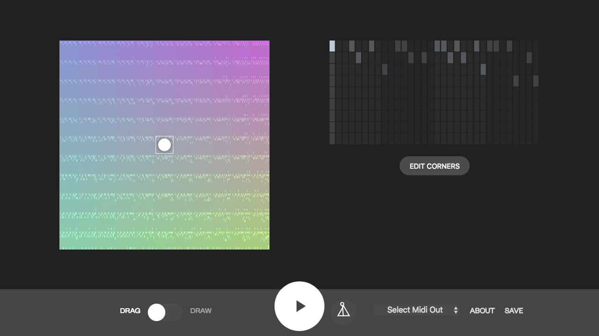

# Beat Blender
### Blend beats using machine learning to create music in a fun new way. [g.co/beatblender](https://g.co/beatblender)

Built using [deeplearn.js](https://deeplearnjs.org) and [MusicVAE](https://github.com/tensorflow/magenta/tree/master/magenta/models/music_vae).

## Usage

Beat Blender requires the [GCloud SDK](https://cloud.google.com/sdk/downloads) for running the server and [node + npm](http://nodejs.org) for javascript development.

1. Run `npm install` to install all of the dependencies of this project.
2. Run `npm start` to begin all file-watchers and to initialize the server on port `8080`
3. Open `http://localhost:8080`

## Easter eggs
You have added a few query-strings that you can play with, you can load a different model for MusicVAE using `checkpoint=url` or a custom model for generating new beats with `samplerCheckpoint=url`

## Contributors
Made by [Kyle Phillips](http://haptic-data.com) and [Torin Blankensmith](http://torinblankensmith.com) with friends at the Google Creative Lab in collaboration with [Adam Roberts](https://github.com/adarob) and the Magenta team.

This is not an officially supported Google product.

## License
Copyright 2017 Google Inc.
Licensed under the Apache License, Version 2.0 (the "License"); you may not use this file except in compliance with the License. You may obtain a copy of the License at
http://www.apache.org/licenses/LICENSE-2.0

Unless required by applicable law or agreed to in writing, software distributed under the License is distributed on an "AS IS" BASIS, WITHOUT WARRANTIES OR CONDITIONS OF ANY KIND, either express or implied. See the License for the specific language governing permissions and limitations under the License.

## Final Thoughts
We encourage open sourcing projects as a way of learning from each other. Please respect our and other creators’ rights, including copyright and trademark rights when present, when sharing these works and creating derivative work.

If you want more info on Google's policy, you can find that [here](https://www.google.com/policies/).
